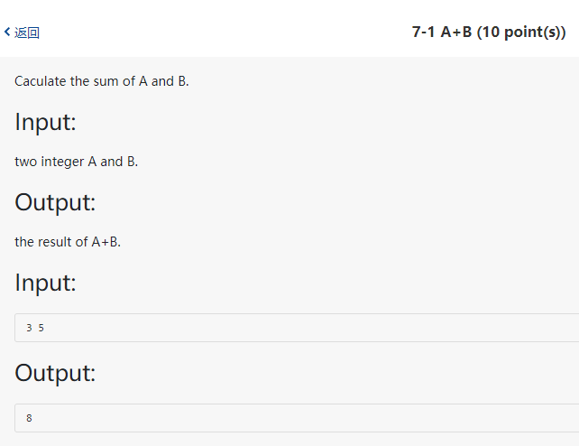
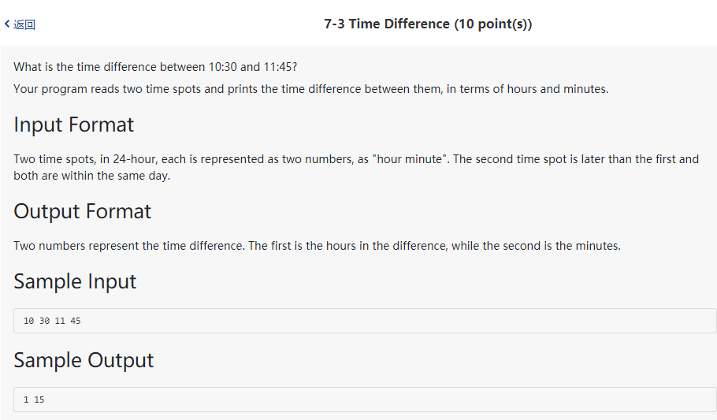
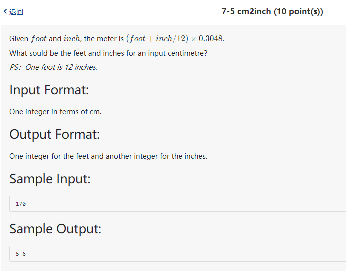
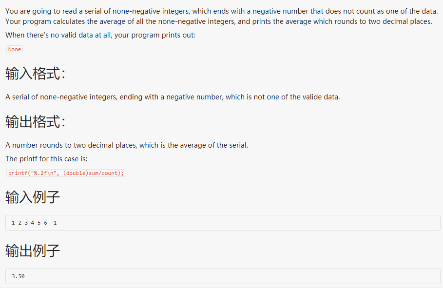
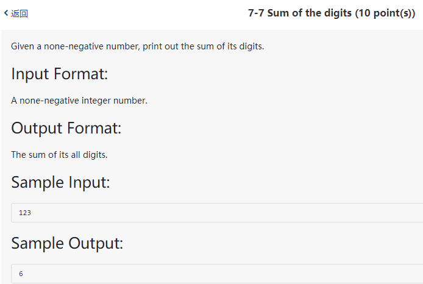
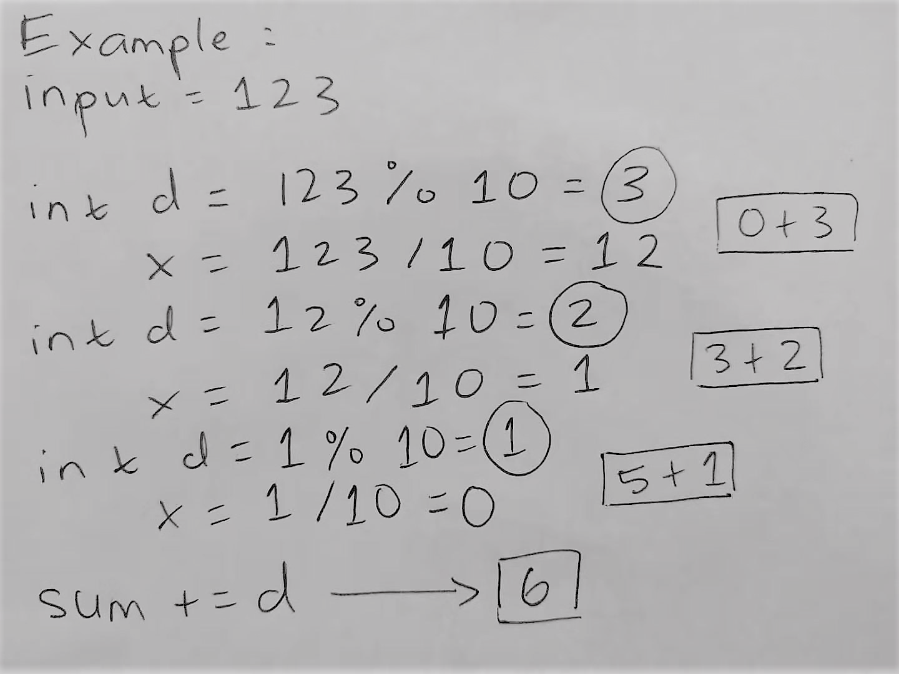
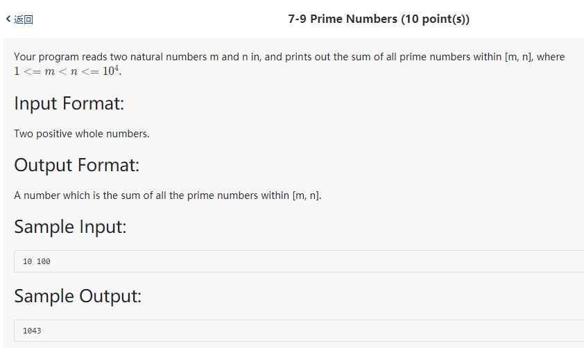

Softwares needed: 
1. JDK
2. IDEA
3. Microsoft Visual Code

## The legendary hello world!
In Java, only use "" (double quote) for string. Single quote is for a character only. 

    public class A{
      public static void main(String[] args){
        System.out.println("The Legendary Hello World!");
    }

## Java scanner
    import java.util.Scanner;
    
    public class A{
      public static void main(String[] args){
        Scanner in = new Scanner(System.in);
        int x = in.nextInt();
        System.out.println("Hello World!");
        System.out.println(x);
        in.close();
      }
    }
    
To read input from user: 
> Scanner in = new Scanner(System.in)

Input types: 
More info: https://www.javatpoint.com/Scanner-class 
> nextXXX()

To read strings: 
> nextLine()

To read a single character: 
> next().charAt(0)

## Format specifiers
More info: https://www.geeksforgeeks.org/format-specifiers-in-java/ 
> System.out.println((23+12)+" "+34)

will have the same output as: 
> System.out.printf("%d %d\n",23+12,34)

The output will be **35 34**. If there is no space between " " and %d %d\n, then the result will be 3534. 
 
## 1. Calculate the sum of two numbers

    import java.util.Scanner;
    public class Main{
        public static void main(String[] args){
            Scanner in = new Scanner(System.in);
            int a = in.nextInt();
            int b = in.nextInt();
            System.out.println(a+b);
            in.close();
        }
    }
 

## 2. Reversed 3 digit numbers

    import java.util.Scanner;
    public class Main{
        public static void main(String[] args){
            Scanner in = new Scanner(System.in);
            int a = in.nextInt();
            int f = a/100;
            int s = a%100/10;
            int t = a%10;
            System.out.println(t*100+s*10+f);
            in.close();
        }
    }
    
The reverse of 345 is 543. We need to grab the numbers separately, then combine them using either **System.out.printf("%d%d%d",t,s,f)** or **System.out.println(t*100+s*10+f)** 
    
    345%10 = 5
    345%100/10 = 4
    345/100 = 3
     

## 3. Time Difference

    import java.util.Scanner;
    public class Main{
        public static void main(String[] args){
            Scanner in = new Scanner(System.in);
            int hour1 = in.nextInt();
            int min1 = in.nextInt();
            int hour2 = in.nextInt();
            int min2 = in.nextInt();
            int diff = hour2*60+min2 - (hour1*60+min1);
            System.out.printf("%d %d\n", diff/60, diff%60);
            in.close();
        }
    }
 

## 4. Comparing two numbers

    import java.util.Scanner;
    public class Main {
        public static void main(String[] args) {
            Scanner in = new Scanner(System.in);
            int a = in.nextInt();
            int b = in.nextInt();
            if (a>b) {
                System.out.println(a);
            } else {
                System.out.println(b);
            }
            in.close();
        }
    }
 

## 5. Converting height

    import java.util.Scanner;
    public class Main {
        public static void main(String[] args) {
            Scanner in = new Scanner(System.in);
            int height = in.nextInt();
            double x = height / 30.48;
            int xi = (int) x;
            double inc = (x-xi)*12;
            int inci = (int) inc;
            System.out.println(xi + " " +inci);
            in.close();
        }
    }
    
1 feet is 30.48 cm, so we need to divide the input (height in cm) by 30.48 to get the height in feet. After that, use **(int)XXX** to convert a decimal to a whole number. Now, let's calculate the remainder in inches! Firstly, get the decimal part of the height in feet, then multiply it by 12 because 1 feet is 12 inches. Convert the result to a whole number, done!
 

## 6. Calcualting average

    import java.util.Scanner;
    public class Main {
        public static void main(String[] args) {
            Scanner in = new Scanner(System.in);
            int sum = 0;
            int cnt = 0;
            int x;
            while (true) {
                x = in.nextInt();
                if (x >= 0) {
                    sum += x;
                    cnt ++;
                } else {
                    break;
                }
            }
            if (cnt == 0){
                System.out.println("None");
            } else{
            System.out.printf("%.2f\n", (double)sum/cnt);
            }
            in.close();
        }
    }
 

## 7. Sum of the digits

    import java.util.Scanner;
    public class Main {
        public static void main(String[] args) {
            Scanner in = new Scanner(System.in); 
            int sum = 0;
            int x = in.nextInt();
                while (true) {
                    if (x > 0) {
                        int d = x % 10;
                        x = x / 10;
                        sum += d;
                        } else {
                            break;
                        }
                    }
                System.out.println(sum);
                in.close();
                }
            }
            

 

## 8. Prime number

    import java.util.Scanner;
    public class Main {
        public static void main(String[] args) {
            Scanner in = new Scanner(System.in);
            int x = in.nextInt();
            boolean IsPrime = true;
            int i;
            for (i = 2; i < x; i++) {
                if (x % i == 0) {
                    IsPrime = false;
                }
            }
            if (x < 2) {
                IsPrime = false;
            }
            if (IsPrime == true){
                System.out.println(x + " is a prime number.");
            } else{
                System.out.println(x + " is not a prime number.");
            }
            in.close();
        }
    }
   
Unlike Python, there is no **for i in range()** in Java. We need to use: 
> for (initialization; test condition; increment/decrement operator) 

If the user's input can be divided by another number other than itself, then it is not a prime number.  
 

## 9. Sum of all prime numbers between [start,end]

        int start = in.nextInt();
        int end = in.nextInt();
        int sum = 0;
        int i;
        int x;
        for (i = start; i < end + 1; i++) {
            boolean IsPrime = true;
            for (x = 2; x < i; x++) {
                if (i % x == 0) {
                    IsPrime = false;
                    break;
                    }
            }
            if (i == 1) {
                IsPrime = false;
            }
            if (IsPrime) {
                sum = sum + i;
            }
        }
        System.out.println(sum);
        in.close();
        }
    }
 

## 10. Sum of the first N prime numbers

    import java.util.Scanner;
    public class Main {
    public static void main(String[] args) {
        Scanner in = new Scanner(System.in);
        int N = in.nextInt();
        int cnt = 0;
        int num = 2;
        int sum = 0;
        int i;
        while (cnt != N) {
            boolean IsPrime = true;
            for (i = 2; i <= Math.sqrt(num); i++) {
                if (num % i == 0) {
                    IsPrime = false;
                    break;
                }
            }
            if (IsPrime) {
                cnt++;
                sum = sum + num;
            }
            num++;
        }
        System.out.println(sum);
    }
}
