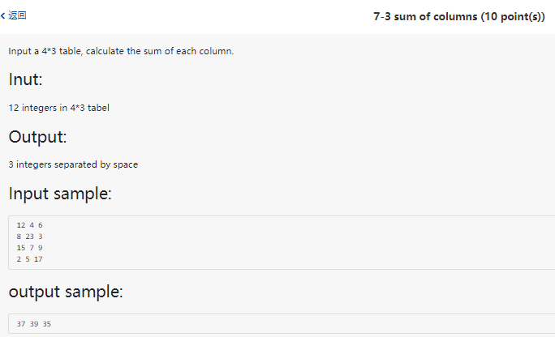

        import java.util.Scanner;
        public class Main{
        public static void main(String[] args){
                Scanner in = new Scanner(System.in);
                int n = in.nextInt();
                StringBuffer sb = new StringBuffer();
                for (int i=0; i<=n; i++){
                        sb.append(i);
                }
                String f = sb.toString();
                int flen = f.length();
                int a = in.nextInt();
                int b = in.nextInt();
                String s = f.substring(a,b+1);
                int c = in.nextInt();
                String d = Integer.toString(c);
                int occurance = s.length() - s.replace(d, "").length();
                System.out.println(flen+" "+occurance);
                in.close();
        }
        }

        import java.util.Scanner;
        public class NumberofPass{
                public static void main(String[] args){
                        Scanner in = new Scanner(System.in);
                        String s = in.nextLine();
                        String temp[] = s.split(" ");
                        String w = "pass";
                        int count = 0;
                        for (int i = 0; i < temp.length; i++) {
                        if (w.equals(temp[i]))
                        count++;
                        }
                        System.out.println(count);
                }
        }

        import java.util.Scanner;
        public class SumofColumns{
            public static void main(String[] args){
                Scanner in = new Scanner(System.in);
                int table[][]=new int[4][3];
                for(int row=0; row<4; row++){
                    for(int col=0;col<3;col++){
                    table[row][col]=in.nextInt();
                    }
                }
                //System.out.println(table.length); -> to check the length of the row
                int scr;
                for (int i = 0; i<3; i++){
                scr = 0;
                    for (int j = 0; j<4; j++){
                        scr = scr + table[j][i];
                    }
                System.out.print(scr+" ");
                }
            }
        }

        import java.util.Scanner;
        public class LowerCase{
            public static void main(String[] args){
                Scanner in = new Scanner(System.in);
                String st = in.nextLine();
                int lines = in.nextInt();
                int table[][] = new int [lines][2];
                String[] chr = new String[lines];
                for (int row=0; row<lines; row++){
                    for (int col=0; col<2; col++){
                        table[row][col] = in.nextInt();
                    }
                chr[row] = in.next();
                }
                for (int i=0; i<lines; i++){
                    for (int j=0; j<1; j++){
                        String sub = st.substring(table[i][j], table[i][j+1]+1);
                        String ch = chr[i];
                        int occurance = sub.length() - sub.replace(ch,"").length();
                        System.out.println(occurance);
                    }
                }
                in.close();
            }
        }

        import java.util.*;
        import java.util.Scanner;
        public class ScoreDataProcessing{
        public static void main(String[] args){
            Scanner in = new Scanner(System.in);
            HashMap<String, String> sidname = new HashMap<String, String>();
            //nested hashmap to store both the course initial and grade
            HashMap<String, HashMap<String, String>> sidgrade = new HashMap<String, HashMap<String, String>>();
            System.out.println("Enter the data below. Whitespace after comma is not allowed.\nFor         
            example:\n3180300812,Adele\n3180300812,Java,95\nType EXIT when you are finished");
            while (true) {
                String line = in.next();
                String[] sp = line.split(",");
                if (sp.length == 2){
                    sidname.put(sp[0], sp[1]);
                }
                if (sp.length == 3){
                    boolean isKeyPresent = sidgrade.containsKey(sp[0]);
                    if (isKeyPresent == false){
                        sidgrade.put(sp[0], new HashMap<String, String>());
                    }
                    sidgrade.get(sp[0]).put(sp[1],sp[2]);
                }
                if (line.equals("EXIT")){
                    break;
                }
        }
        System.out.println("Enter Student ID to check grades:");
        String id = in.next();
        System.out.println(id+", "+sidname.get(id)+", "+sidgrade.get(id).values().toString().replace("[","").replace("]",""));
        in.close();
    }
    }
