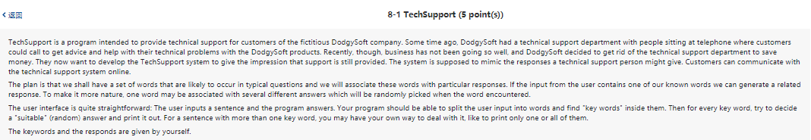

    import java.util.Scanner;
    import java.util.Random;
    import java.util.HashMap;

    public class TechSupport{
            public static void main (String[] args) {
            HashMap<String, String[]> chat = new HashMap<String, String[]>();
            Random random = new Random();
            //int index = random.nextInt();
            chat.put("happy", new String[] {"Let's go out", "I am happy too", "You are amazing!"});
            chat.put("sad", new String[] {"Tomorrow will be better", "There's always a bright side in everything", "Be happy!"});
            Scanner in = new Scanner(System.in);
            System.out.println("Welcome to Tech Support. How can I help you? Type 'bye' to end the conversation");
            while (true){
                    String ms = in.nextLine();
                    String[] word = ms.split("\\s+");
                    for (String s : word){
                            if (chat.containsKey(s)){
                                    int index = random.nextInt(chat.get(s).length);
                                    String response = chat.get(s)[index];
                                    System.out.println(s + "? " + response);
                            }
                    }
                    if (ms.equals("bye")){
                            break;
                    }

            }
            }
    }
